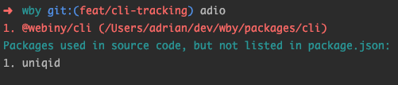

# adio
[](https://travis-ci.org/doitadrian/adio)
[](https://coveralls.io/github/doitadrian/adio?branch=master)
[](https://www.npmjs.com/package/adio) 
[](https://www.npmjs.com/package/adio)

[](https://github.com/prettier/prettier)
[](#contributors)
[](http://makeapullrequest.com)
  
`adio` (all-dependencies-in-order) is a small library that checks your code
for dependencies that are not listed in the package.json and vice-versa,
checks package.json files for dependencies that are not used in code. 



## Install
```
npm install --save adio
```

Or if you prefer yarn: 
```
yarn add adio
```

## Basic usage
Once you've installed the library, you can run the `adio` command like
so:

```adio --packages "components/*" --packages "packages/*"```

This will check all folders located in `packages` folder, eg. 
`packages/something-1` and `packages/something-2`. If all dependencies
are in order, the process will exit with the exit code `0`, and will 
print a success message. Otherwise, the exit code `1` will be returned, 
and a list of all issues will be printed in the console.

## Configuration files
Even though it can be done via the CLI, parameters can also
be set via the `.adiorc.js` or similar [cosmiconfig](https://www.npmjs.com/package/cosmiconfig) supported config 
types (eg. `.adiorc.json` or even via the `adio` key in `package.json`), 
placed in the current working directory. This is often a better 
alternative to passing parameters inline via the CLI.

By just creating a following `.adiorc.json` file in the current working
directory...

```json
{
  "packages": ["packages/*", "components/*", "..."]
}
```

and then running the `adio` command in the same directory, we can 
achieve the same effect as by manually running the previsuly shown 
`adio --packages "components/*" --packages "packages/*"` command.

This way will also make it easier to pass in additional config parameters.

## Additional configuration parameters and overriding

## Parameters reference
The following shows 

## Contributors

Thanks goes to these wonderful people


 

## Contributors

Thanks goes to these wonderful people ([emoji key](https://github.com/kentcdodds/all-contributors#emoji-key)):

<!-- ALL-CONTRIBUTORS-LIST:START - Do not remove or modify this section -->
<!-- prettier-ignore -->
| [<br /><sub><b>Adrian Smijulj</b></sub>](https://github.com/doitadrian)<br />[💻](https://github.com/doitadrian/adio/commits?author=doitadrian "Code") [📖](https://github.com/doitadrian/adio/commits?author=doitadrian "Documentation") [💡](#example-doitadrian "Examples") [👀](#review-doitadrian "Reviewed Pull Requests") [⚠️](https://github.com/doitadrian/adio/commits?author=doitadrian "Tests") |
| :---: |
<!-- ALL-CONTRIBUTORS-LIST:END -->

This project follows the [all-contributors](https://github.com/kentcdodds/all-contributors) specification. Contributions of any kind welcome!
