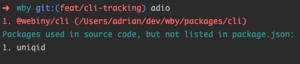

# adio
[](https://github.com/adrians5j/adio/actions/workflows/ci.yml)
[](https://www.npmjs.com/package/adio) 
[](https://www.npmjs.com/package/adio)
[](http://makeapullrequest.com)
  
`adio` (all-dependencies-in-order) is a small library that checks your code
for dependencies that are not listed in the package.json and vice-versa,
checks package.json files for dependencies that are not used in code. 

<p align="center">
  
</p>

## Install
```
npm install --save adio
```

Or if you prefer yarn: 
```
yarn add adio
```

## Basic usage
Once you've installed the library, you can run the `adio` command like
so:

```adio --packages "components/*" --packages "packages/*"```

This will check all folders located in `packages` folder, eg. 
`packages/something-1` and `packages/something-2`. If all dependencies
are in order, the process will exit with the exit code `0`, and will 
print a success message. Otherwise, the exit code `1` will be returned, 
and a list of all issues will be printed in the console.

## Configuration files
Even though it can be done via the CLI, parameters can also
be set via the `.adiorc.js` or similar [cosmiconfig](https://www.npmjs.com/package/cosmiconfig) supported config 
types (eg. `.adiorc.json` or even via the `adio` key in `package.json`), 
placed in the current working directory. This is often a better 
alternative to passing parameters inline via the CLI.

By just creating a following `.adiorc.json` file in the current working
directory...

```json
{
  "packages": ["packages/*", "components/*", "..."]
}
```

and then running the `adio` command in the same directory, we can 
achieve the same effect as by manually running the previously shown 
`adio --packages "components/*" --packages "packages/*"` command.

This way will also make it easier to pass in additional config parameters.

## Additional configuration parameters

- **ignoreDirs**: Array of directories to ignore. Defaults to `['node_modules']`.
- **ignore**: Object controlling which dependencies to skip.
  - **src**: deps to ignore in source files — array of strings, or `true` to skip all src checks
  - **dependencies**: ignore listed `dependencies` — array of strings or `true`
  - **devDependencies**: ignore listed `devDependencies` — array of strings or `true`
  - **peerDependencies**: ignore listed `peerDependencies` — array of strings or `true`
- **traverse**: custom AST traversal function `({ node, isRelative, push }) => void`. Called for every AST node; call `push(specifier)` to register additional imports that adio's default traversal wouldn't catch.

A more comprehensive `.adiorc.js` might look like this:

```json
{
  "packages": ["packages/*"],
  "ignoreDirs": ["node_modules", "dist", "coverage"],
  "ignore": {
    "src": ["path", "url", "http"],
    "devDependencies": true,
    "peerDependencies": true
  }
}
```

### Configuration Overriding

It is common to have an `adio` configuration at the root of a monorepo. Then, say I did want `adio` to check `peerDependencies` usage in a particular package, I could extend the configuration above by adding a package local `packages/*/.adiorc` like so:

```json
{
  "ignore": {
    "peerDependencies": false
  }
}
```
